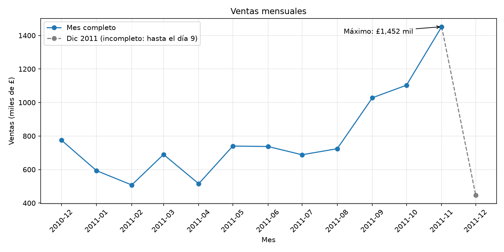
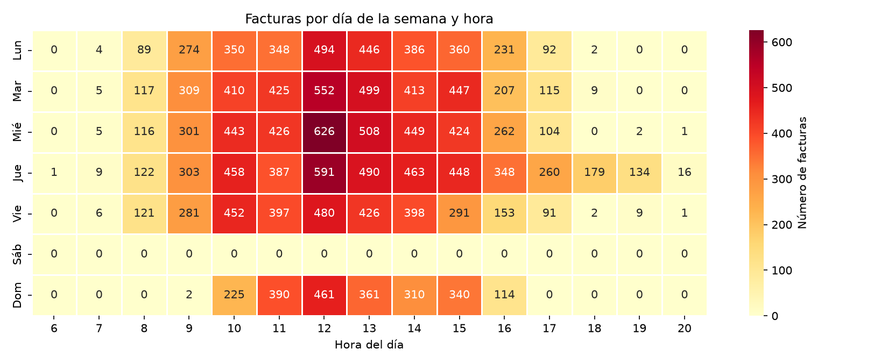
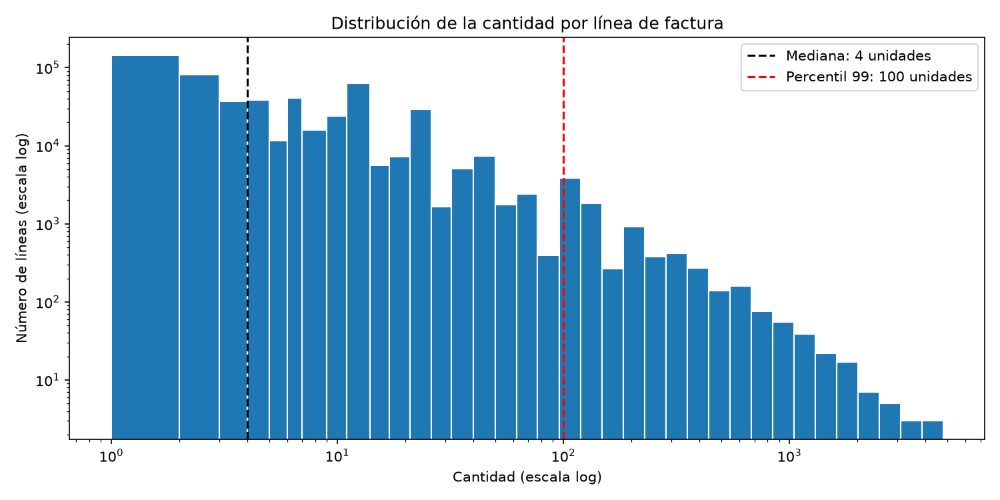

# Online Retail: Adquisición, procesamiento y visualización de datos

Adquisición, limpieza, almacenamiento en una db SQLite, análisis exploratorio y visualización del dataset *Online Retail* del UCI Machine Learning Repository.

## 1. Datos

| Característica | Valor |
|---|---|
| Fuente | [UCI Machine Learning Repository, ID 352](https://archive.ics.uci.edu/dataset/352/online+retail) |
| Autor | Daqing Chen, London South Bank University (DOI 10.24432/C5BW33) |
| Licencia | CC BY 4.0 |
| Contenido | Transacciones de un minorista británico que vende artículos de regalo en línea |
| Periodo | 01/12/2010 – 09/12/2011 |
| Registros | 541,909 originales · 522,538 tras la limpieza |
| Archivo original | `Online Retail.xlsx` (22.6 MB) |

Cada fila del dataset es una **línea de factura**: un producto dentro de una compra. Una factura (compra) agrupa varias líneas, en promedio 26.

## 2. Estructura del repositorio

```
├── data/
│   ├── raw/          # Excel original, solo lectura
│   ├── interim/      # copia de trabajo en .parquet
│   └── processed/    # db SQLite con los datos limpios
├── scripts/
│   ├── 00_descarga_datos.py        # descarga el dataset y crea la copia de trabajo
│   ├── 01_adquisicion_limpieza.py  # limpieza y carga en la db
│   ├── 02_eda.py                   # análisis exploratorio
│   └── 03_visualizacion.py         # genera las gráficas
├── reports/
│   ├── descripcion_dataset.txt     # descripción del dataset
│   └── figures/                    # gráficas en .png
├── requirements.txt
└── README.md
```

Los archivos de `data/` no se suben al repositorio: se generan al ejecutar los scripts.

## 3. Ejecución

Los scripts se ejecutan en orden desde la raíz del proyecto:

```bash
pip install -r requirements.txt
python scripts/00_descarga_datos.py
python scripts/01_adquisicion_limpieza.py
python scripts/02_eda.py
python scripts/03_visualizacion.py
```

Dependencias: pandas, numpy, openpyxl (leer Excel), pyarrow (leer y guardar Parquet), matplotlib y seaborn. La db se maneja con `sqlite3`, que viene incluido en Python.

## 4. Proceso

```
Excel original  →  copia .parquet  →  limpieza  →  db SQLite  →  EDA y gráficas
    (raw)            (interim)                     (processed)
```

1. **Descarga** 
`00_descarga_datos.py` descarga el .zip desde UCI, extrae el Excel y lo deja como solo lectura para no modificar el original. Luego guarda una copia en Parquet, un formato que conserva los tipos de datos y se lee mucho más rápido que Excel.
2. **Limpieza** 
`01_adquisicion_limpieza.py` aplica los criterios de limpieza y guarda el resultado en la db `online_retail.db`, tabla `ventas`.
3. **EDA** 
`02_eda.py` lee la tabla desde la db, genera la metadata y describe cada campo.
4. **Gráficas** 
`03_visualizacion.py` genera tres gráficas con Matplotlib y Seaborn.

## 5. Parte 1: Limpieza de datos

**Objetivo:** obtener una tabla de **ventas válidas**, es decir, un producto real vendido en cantidad positiva y a precio positivo. Un criterio se aplica solo si afecta ese objetivo.

| # | Criterio | Filas eliminadas | ¿Por qué? |
|---|---|---:|---|
| 1 | Duplicados exactos | 5,268 | Filas idénticas en todas las columnas inflarían las ventas. Se eliminan primero para que los siguientes conteos sean sobre registros únicos. |
| 2 | Cancelaciones (factura con prefijo `C`) | 9,251 | No son ventas, y sus cantidades negativas restarían volumen. |
| 2b | Pedidos anulados | 2 | Dos pedidos de 74,215 y 80,995 unidades que el mismo cliente canceló completos entre 12 y 16 minutos después. No son ventas reales. |
| 3 | Cantidad o precio ≤ 0 | 2,512 | Ajustes de inventario y registros sin valor comercial. |
| 4 | Códigos que no son productos | 2,338 | Envíos, comisiones, ajustes manuales, muestras y vales de regalo. |

**Resultado:** 541,909 → 522,538 filas. Se elimina el 3.57 % de los datos.

**¿Cómo se identificaron los códigos que no son productos?**
La documentación indica que un producto tiene un código de 5 dígitos. Se listaron los códigos que no siguen ese patrón y se revisó la descripción de cada uno: `POSTAGE`, `Manual` o `AMAZON FEE` no son productos, mientras que `GIRLS PARTY BAG` (`DCGSSGIRL`) sí lo es y se conserva.

**¿Qué no se eliminó?**
- **Filas sin cliente (25.14 %):** son ventas reales. Eliminarlas reduciría una cuarta parte de las ventas por producto, país y tiempo.
- **Cantidades altas:** muchos clientes son mayoristas, así que una compra grande no es un error. Solo se excluyeron los dos pedidos que se verificó que fueron anulados.

Además, se eliminan espacios sobrantes en las descripciones y `CustomerID` se guarda como entero (`Int64`), que admite valores nulos.

## 6. Parte 2: Análisis exploratorio

La tabla se lee desde la db con `pd.read_sql`. SQLite no guarda fechas ni enteros con nulos, así que `InvoiceDate` y `CustomerID` se restauran a su tipo al leer.

### ¿Qué información contiene el dataset?

La descripción general está en [`reports/descripcion_dataset.txt`](reports/descripcion_dataset.txt).

### Metadata por campo

| Campo | Tipo | Nulos (%) | Valores únicos |
|---|---|---:|---:|
| InvoiceNo | texto | 0 | 19,771 facturas |
| StockCode | texto | 0 | 3,907 productos |
| Description | texto | 0 | 4,001 |
| Quantity | entero | 0 | 372 |
| InvoiceDate | fecha y hora | 0 | 18,330 |
| UnitPrice | decimal | 0 | 497 |
| CustomerID | entero | 25.14 | 4,333 clientes |
| Country | texto | 0 | 38 países |

### Descripción por campo

| Campo | Según la documentación | Lo que se encontró |
|---|---|---|
| InvoiceNo | 6 dígitos; prefijo `c` = cancelación | El prefijo real es `C` (mayúscula). |
| StockCode | 5 dígitos por producto | Hay códigos alfanuméricos, de productos y de servicios. |
| Description | Nombre del producto | Hay más descripciones que códigos: un código puede tener varios nombres. |
| Quantity | Cantidad por transacción | Mediana de 4 unidades; el 75 % de las líneas tiene 12 o menos; máximo 4,800. |
| InvoiceDate | Fecha y hora | Coincide con el periodo documentado. Diciembre 2011 solo llega al día 9. |
| UnitPrice | Precio unitario en libras | Mediana de £2.08; el 75 % cuesta £4.13 o menos. |
| CustomerID | 5 dígitos; sin faltantes | 25.14 % de líneas sin cliente. |
| Country | País del cliente | Reino Unido concentra el 91.64 % de las líneas. |

**La documentación no siempre coincide con los datos:** indica que no hay valores faltantes, pero había 1,454 nulos en `Description` y 135,080 en `CustomerID`.

**Dato relevante:** al excluir los dos pedidos anulados, la desviación estándar de `Quantity` bajó de 156.6 a 37.9, mientras que la mediana no cambió. Solo dos filas de más de medio millón bastaban para distorsionar una medida sensible a valores extremos.

## 7. Parte 3: Visualización

Se generan tres gráficas:

| Figura | Técnica | Opción avanzada |
|---|---|---|
| 01 | Serie temporal | Se diferencia el mes incompleto y se anota el máximo |
| 02 | Mapa de calor | Matriz día × hora con el valor en cada celda |
| 03 | Histograma | Escala logarítmica en ambos ejes |

### Pregunta 1: ¿Cómo evolucionan las ventas a lo largo del periodo?



**Respuesta**

- De enero a agosto 2011 las ventas se mantienen entre £508 mil y £740 mil por mes.
- Desde septiembre crecen de forma sostenida, y noviembre alcanza el máximo (£1,452 mil), el doble que agosto.
- Diciembre 2010 también supera a los meses de enero a agosto, lo que sugiere que el fin de año es un periodo de alta actividad.
- El patrón es compatible con la temporada navideña de un negocio de regalos, aunque con un solo año de datos no se puede confirmar que se repita.
- Diciembre 2011 (£446 mil) solo tiene 9 días de datos, por eso no representa una caída real.

### Pregunta 2: ¿En qué días y horas se concentran las compras?



**Respuesta**

- No hay ninguna compra en sábado en todo el periodo.
- El domingo tiene pocas compras (11 %) y solo entre las 9 y las 16 h.
- Entre semana las compras se concentran de 10 a 15 h, con el máximo a las 12 h todos los días.
- El jueves es el día con más compras (21 %) y el único con actividad entre las 18 y 20 h.

### Pregunta 3: ¿Cuántas unidades se compran por línea de factura?



**Respuesta**

- La mitad de las líneas tiene 4 unidades o menos, y el 99 % tiene 100 o menos.
- Se usa escala logarítmica porque las cantidades van de 1 a 4,800: en escala normal casi todos los datos quedarían en una sola barra y las compras grandes no se verían.
- Hay muchas compras pequeñas y muy pocas grandes.
- Se observan picos en 6, 12 y 24 unidades: 12 es la tercera cantidad más frecuente, lo que indica ventas por paquetes o docenas.
- En una primera versión aparecían dos barras aisladas de más de 70,000 unidades. Al revisarlas se encontró que eran los dos pedidos anulados, lo que llevó a agregar el criterio 2b.

## 8. Limitaciones

- Los pedidos cancelados más pequeños siguen en los datos.
- Con un solo año de datos no se puede confirmar estacionalidad.
- El 25 % de las líneas no tiene cliente, lo que limita los análisis por cliente.
- La concentración en Reino Unido limita las comparaciones entre países.